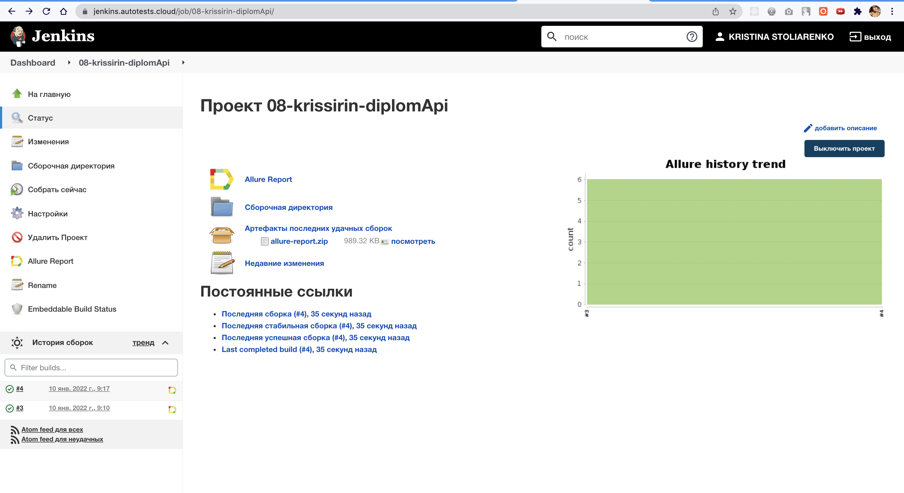
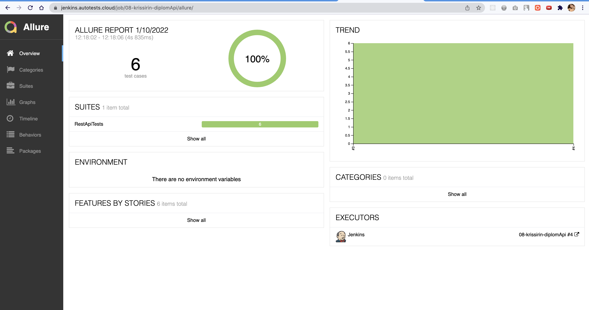
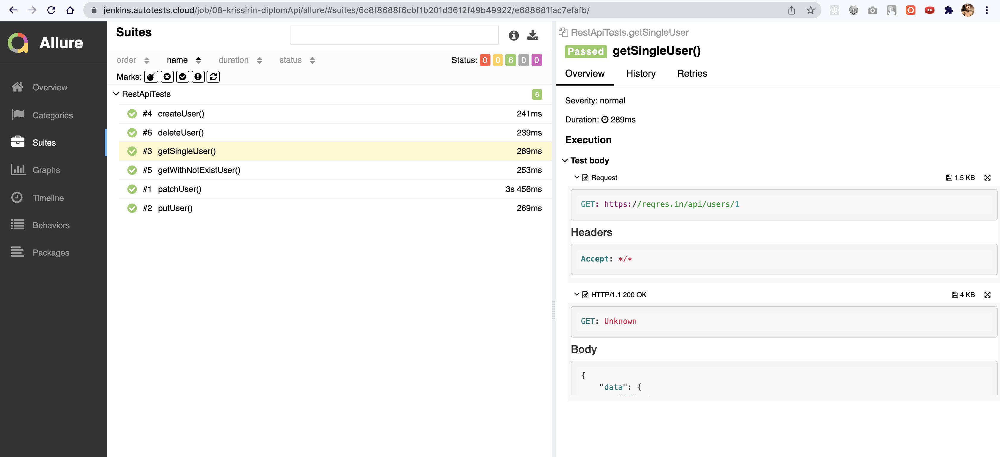

# Проект для сайта [reqres.in](https://reqres.in/)

## :gear: Стек технологий:
| IDEA | Java | Rest-Assured | Allure Report | Gradle | Junit5 | GitHub | Jenkins |
|:--------:|:-------------:|:---------:|:-------:|:----:|:------:|:----:|:----:|:------:|
|  |  |   |  |  |  |  |  |
___

## Тестируемая функциональность
- Создание нового пользователя
- Успешная регистрация пользователя
- Поиск несуществующего пользователя
- Поиск существующего пользователя 
- Изменение данных пользователя
- Удаление пользователя

## В качестве CI системы использован Jenkins
### [Проект](https://jenkins.autotests.cloud/job/08-krissirin-diplomApi/)



## Запуск тестов

Для запуска тестов необходимо выполнить следующую команду:

```bash
gradle clean test
```

##Генерация отчета происходит в Allure Report

Для генерации отчета необходимо выполнить следующую команду:

```bash
allure serve build/allure-results
```



К каждому тесту прикладываются:
- Данные, переданные в запросе
- Данные, полученные в ответе


